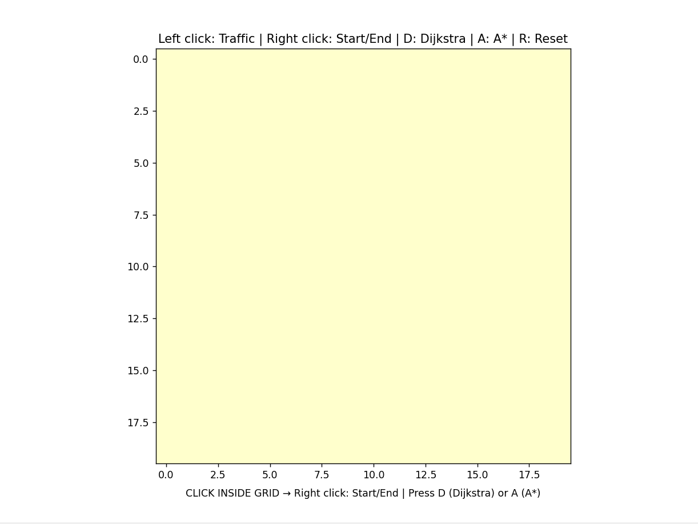
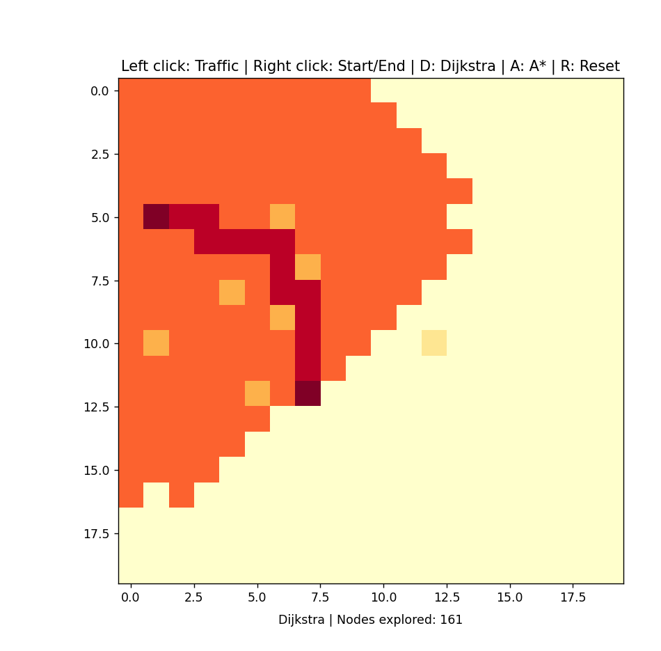
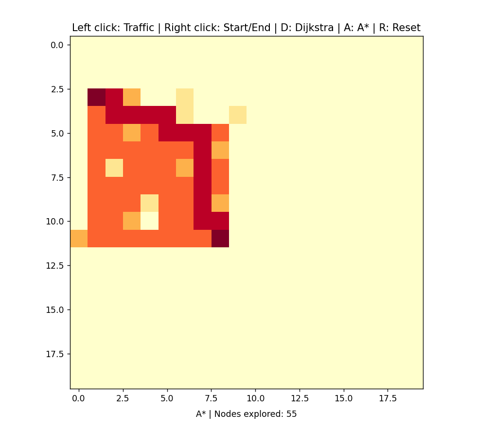

# Grid Pathfinding Visualizer

**Technologies:** Python, NumPy, Matplotlib

Interactive grid-based visualizer for **Dijkstra's** and **A\*** algorithms.  
It demonstrates how shortest paths are explored and constructed in a weighted grid.

## Features
- Step-by-step animation of node exploration and final shortest path.
- Dynamic traffic simulation with adjustable cell weights.
- Controls for setting start/end points, toggling traffic, and resetting the grid.

## Controls
- **Left Click:** Toggle traffic weight of a cell (1 → 5 → 10 → 1)
- **Right Click:** Set start/end positions
- **Keyboard Shortcuts:**
  - `D` → Run **Dijkstra**
  - `A` → Run **A\***
  - `R` → Reset the grid

## Installation
1. Clone the repository:
```bash
git clone https://github.com/<your-username>/grid-pathfinding-visualizer.git
```
2. Install required packages:
```bash
pip install -r requirements.txt
```
3.Run the visualizer:
```bash
python pathfinding_visualizer.py
```
## Project Structure
```text
ShortestPathVisualizer/
├── pathfinding_visualiser.py
├── README.md
├── requirements.txt
└── screenshots/
    ├── astar_algo.png
    ├── dijkstra_algo.png
    └── grid_setup.png
```

## Demo

**Grid Setup:**


**Dijkstra's Algorithm Working:**


**A* Algorithm Working:**


## License
This project is licensed under the MIT License.
